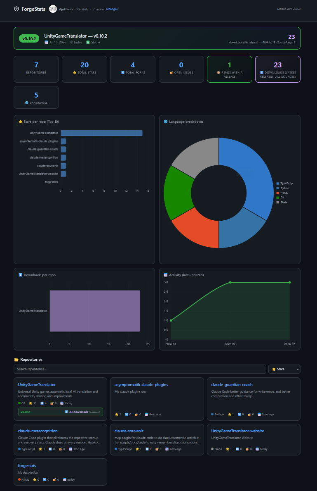
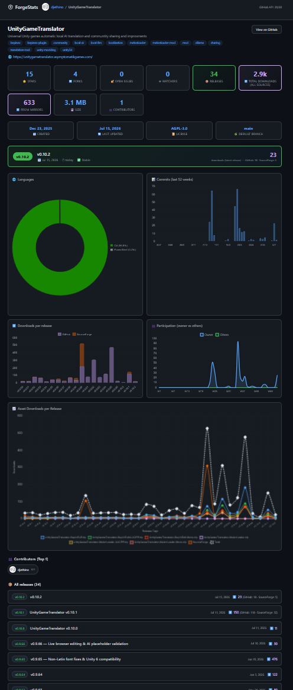
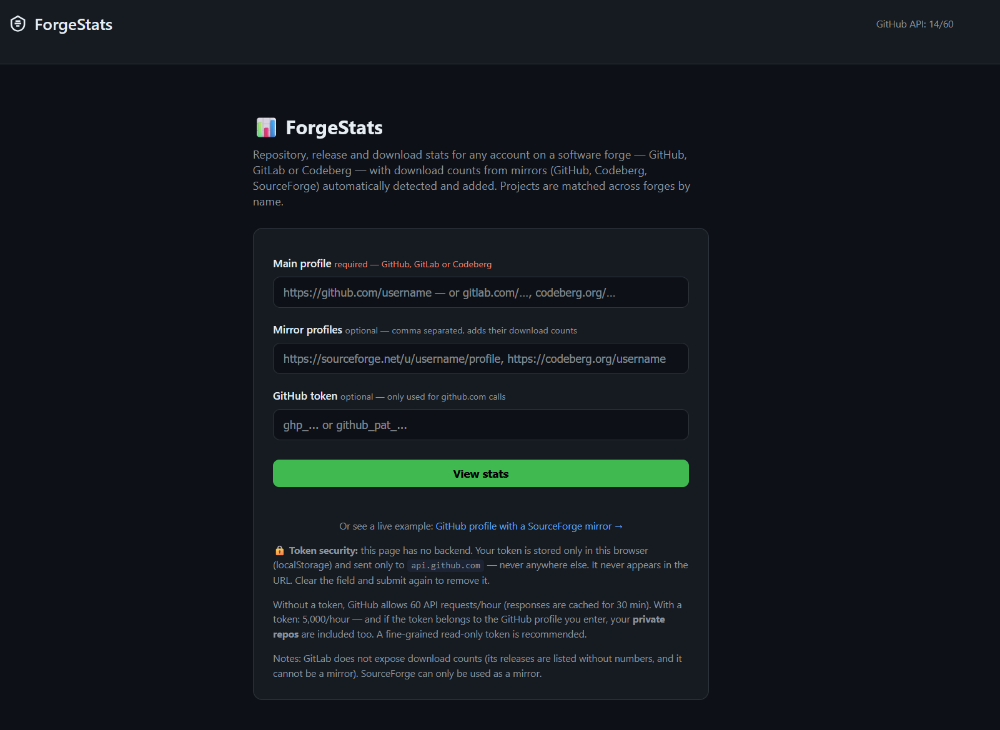

# 📊 ForgeStats

**Repository, release and download stats for any account on a software forge — with mirror download counts aggregated across platforms.**

🔗 **Live: [djethino.github.io/forgestats](https://djethino.github.io/forgestats/)**

Enter a profile link, get a full dashboard: stars, forks, releases, download counts, languages, activity. If your releases are mirrored on another forge, ForgeStats detects the matching projects automatically and **adds their download counts to your totals** — per release.

## Why?

Download counts are scattered. A project released on GitHub and mirrored on SourceForge or Codeberg has three partial numbers and no total. ForgeStats gives you the real one.

## Supported forges

| | As main profile | As mirror (adds download counts) |
|---|:---:|:---:|
| **GitHub** | ✅ | ✅ |
| **Codeberg** and self-hosted **Gitea / Forgejo** | ✅ | ✅ |
| **GitLab** (gitlab.com or self-hosted) | ✅ ¹ | ❌ ¹ |
| **SourceForge** | ❌ ² | ✅ |

Self-hosted instances: prefix the URL with its engine — `gitea:https://git.example.com/username` or `gitlab:https://gitlab.example.com/username`.

¹ GitLab does not track download counts on release assets ([known limitation](https://gitlab.com/gitlab-org/gitlab/-/issues/223338)). A GitLab main profile still shows repos, stars, releases and languages — and gets download numbers from its mirrors.
² SourceForge has no stars/forks/release metadata to build a dashboard from, so it works as a mirror only.

## How it works

- **100% static, no backend.** A single HTML file. All API calls go directly from your browser to the forges' public APIs (they all allow CORS).
- **Mirror matching by name.** `UnityGameTranslator` on GitHub ↔ `unitygametranslator` on SourceForge — names are normalized (lowercase, alphanumeric) and matched automatically from the mirror profile's project list.
- **Per-release aggregation.** Mirror downloads are matched to release tags: GitHub/Codeberg mirrors by release tag, SourceForge by file folder named after the tag (e.g. `/files/v1.2.3/`).
- **Shareable URLs.** `#main=github:user&mirrors=sourceforge:user,codeberg:user` — send your stats page to anyone. A repository URL as input (`github.com/user/repo`) jumps straight to that repo's page.
- **Local history.** Each visit records a daily snapshot of the numbers in your browser — revisit over time and evolution charts (downloads, stars) build up automatically. Stored locally only, nothing is sent anywhere.
- **Export.** Download the repo list or the release table as CSV or JSON.
- **Cached.** API responses are cached in localStorage for 30 minutes to stay within anonymous rate limits.

Repository view — total downloads across all sources, with the per-release GitHub/SourceForge breakdown in the stacked chart:

## GitHub token (optional)

Without a token, GitHub allows 60 API requests/hour — enough for casual use thanks to caching. With a token you get 5,000/hour, and if the token belongs to the profile you enter, your **private repos** are included.

### Recommended token configuration

| | Rate limit boost only | Include your private repos |
|---|---|---|
| **Fine-grained** (recommended, truly read-only) — [create](https://github.com/settings/personal-access-tokens/new) | defaults are fine | Repository access: **All repositories** + Permissions → **Contents: Read-only** (required to read releases; Metadata is added automatically) |
| **Classic** — [create](https://github.com/settings/tokens/new?description=ForgeStats) | no scope needed | check the **repo** scope ⚠️ it also grants *write* access — ForgeStats never writes anything, but prefer fine-grained if you can |

Common pitfalls: a fine-grained token created with the defaults only sees **public** repositories; and without *Contents: Read-only* your private repos would list but show zero releases.

🔒 **Security:** this page has no server. Your token is stored only in your browser's localStorage, sent only to `api.github.com`, and never appears in the URL. To remove it, clear the field and submit again.

## Mirroring conventions

For per-release mirror counts to match, mirrors should follow the usual conventions:

- **GitHub/Codeberg mirrors:** same repo name (case-insensitive), same release tags.
- **SourceForge mirrors:** project slug matching the repo name, files organized in folders named after the release tags (`v1.2.3/…`). This is what standard mirroring scripts produce.

Unmatched projects or tags simply contribute 0 — numbers are never guessed.

## Getting started

No account, no install — open the [live page](https://djethino.github.io/forgestats/), paste your profile links and go:

## Self-hosting

It's one file. Download `index.html`, put it anywhere (GitHub Pages, any static host, or open it locally). No build step, no dependencies besides Chart.js from a CDN.

## License

MIT. It's a small tool shared as-is — feel free to fork it, tweak it and host your own. Adding a forge means writing one adapter (list repos, normalize releases, count downloads) in the `adapters` object.
